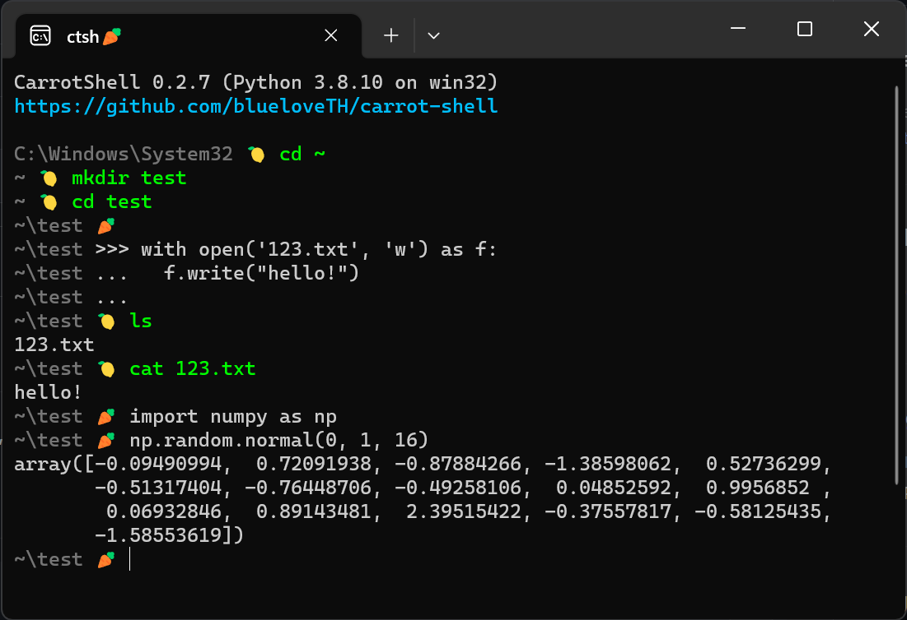

# carrot-shell🥕

carrot-shell🥕 is a smart shell in python, for developers.



## Setup
```
pip install carrot-shell
```

Python 3.8 or later is required.

## Usage
```
ctsh
```

## Switch virtual environment
CarrotShell🥕 only supports using [conda](https://conda.io)
as the virtual environment manager.
You can switch virtual environment by using `conda activate` command.

However, because CarrotShell🥕 itself runs in a python
environment, activate/deactivate virtual environment
will cause all variables and states to be lost.

## Develop
```
git clone https://github.com/blueloveTH/carrot-shell
cd carrot-shell
python -m ctsh
```
